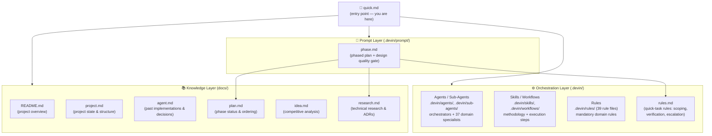
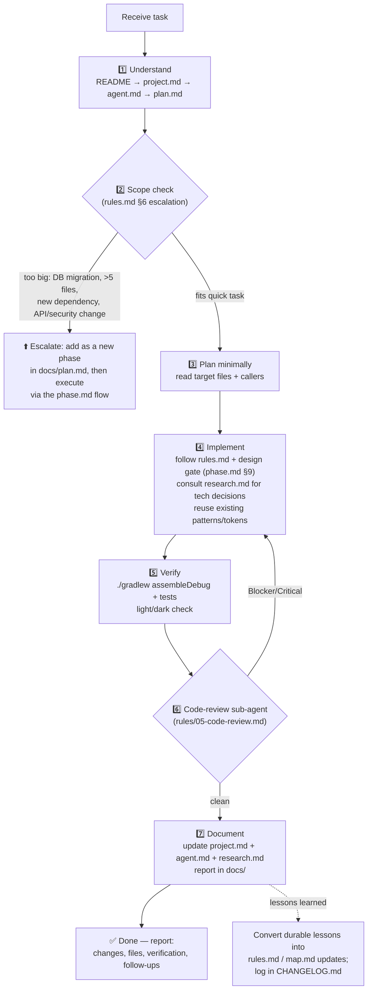
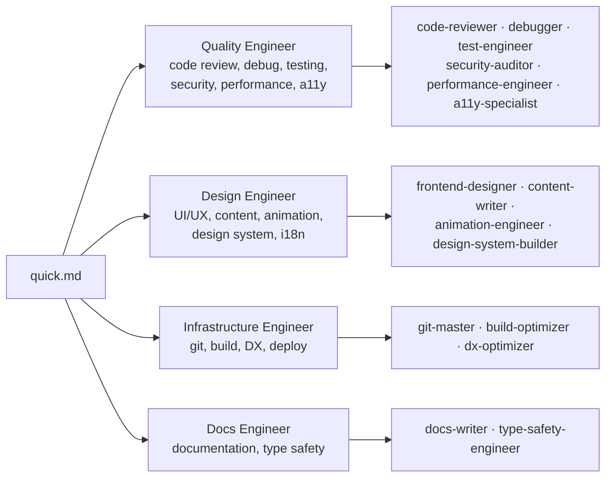

# System Map — How the Prompt System Connects

Referenced by `quick.md` (point 8). Everything flows from `quick.md` — it is the **entry point**. Read the system in the order defined below before starting any task.

## 0. Visual Overview

```
                                ┌─────────────────────┐
                                │      quick.md       │  ← ENTRY POINT
                                │  (task instructions) │
                                └──────────┬──────────┘
                                           │
        ┌──────────────────┬───────────────┼────────────────┬─────────────────┐
        ▼                  ▼               ▼                ▼                 ▼
┌───────────────┐  ┌──────────────┐  ┌─────────────┐  ┌─────────────┐  ┌──────────────┐
│  ORCHESTRATION │  │    PROMPT    │  │    RULES    │  │  KNOWLEDGE  │  │    AGENTS    │
│   (.devin/)    │  │   LAYER      │  │   LAYER     │  │  LAYER      │  │   & SKILLS   │
├───────────────┤  ├──────────────┤  ├─────────────┤  ├─────────────┤  ├──────────────┤
│ agents/       │  │ phase.md     │  │ rules.md    │  │ README.md   │  │ sub-agents/  │
│ sub-agents/   │  │ (phased plan │  │ (quick-task │  │ project.md  │  │ skills/      │
│ workflows/    │  │  + design    │  │  rules)     │  │ agent.md    │  │ workflows/   │
│ skills/       │  │  gate)       │  │             │  │ plan.md     │  │ rules/ (39)  │
│               │  │ map.md (you  │  │             │  │ idea.md     │  │              │
│               │  │  are here)   │  │             │  │ research.md │  │              │
└───────────────┘  └──────────────┘  └─────────────┘  └─────────────┘  └──────────────┘
        │                  │               │                │                 │
        └──────────────────┴───────────────┴───────┬────────┴─────────────────┘
                                                   ▼
                                     ┌──────────────────────────┐
                                     │     TASK LIFECYCLE       │
                                     │                          │
                                     │  Understand → Scope? ──┐ │
                                     │      │        │        │ │
                                     │      │     too big      │ │
                                     │      │        └─→ Escalate to phase.md
                                     │      ▼                 │ │
                                     │  Implement → Verify →  │ │
                                     │  Review ↺ → Document → │ │
                                     │  ✅ Done               │ │
                                     └──────────────────────────┘
```

```
File tree:
.devin/
├── agents/            ← 9 orchestrators (Quality, Design, Infra, Docs Engineers…)
├── sub-agents/        ← 37 domain specialists
├── skills/            ← deep methodology per domain
├── workflows/         ← executable step-by-step plans (/slash-commands)
├── rules/             ← 39 mandatory domain rules (35-agent-system.md = index)
└── prompt/
    ├── quick.md       ← entry point for quick tasks
    ├── phase.md       ← phased plan + research system (§6) + design quality gate (§9)
    ├── rules.md       ← quick-task scoping / verification / escalation rules
    └── map.md         ← this file — the system map

docs/                  ← per-project knowledge — FRESH for every new project
├── project.md         ← project state & structure
├── agent.md           ← past implementations & decisions
├── plan.md            ← phase status & ordering
├── idea.md            ← competitive analysis (what to build)
└── research.md        ← technical research: libraries, best practices, ADRs, gotchas (how to build)

NOTE: .devin/prompt/ is the portable, project-agnostic engine — copy it into any new project as-is.
docs/ contents are disposable per-project artifacts, created fresh by following phase.md points 3–7.
```

## 1. Document & Resource Map



## 2. Task Lifecycle — How a Quick Task Actually Flows



## 3. Agent Delegation Map



Full mapping: `.devin/rules/35-agent-system.md`. Priority when agents disagree: **security > performance > design > DX**.

## 4. Reading Order

1. `README.md` — what the project is
2. `docs/project.md` — current project state and structure (if absent, it will be created per phase.md §3)
3. `docs/agent.md` — past implementations and decisions (if absent, it will be created)
4. `docs/plan.md` — where we are in the phased plan (if absent, it will be created per phase.md §7)
5. `.devin/prompt/phase.md` — standards every change must meet (research system §6, design gate §9, report format §10, definition of done §11)
6. `.devin/prompt/rules.md` — quick-task scoping, verification, and escalation rules
7. Relevant `.devin/rules/*` for the task domain (see rule index in `35-agent-system.md`)
8. `docs/idea.md` — what to build (competitive analysis; created per phase.md §5)
9. `docs/research.md` — how to build it (tech decisions, best practices, gotchas) — consult before adding any dependency or pattern (if absent, create from the template in phase.md §6)

## 5. Write-Back Order (task end)

1. `docs/project.md` — update project state
2. `docs/agent.md` — record what was implemented and decisions made
3. `docs/research.md` — append any new tech findings, decisions, or gotchas encountered
4. Task-specific docs — always inside `docs/`
5. Completion report: what changed, files touched, verification results, follow-ups
