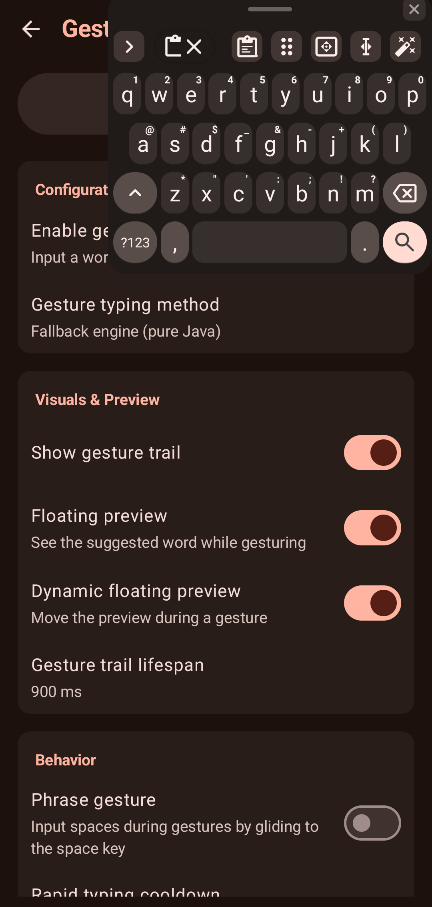

# TypeCraft

<picture>
  <source media="(prefers-color-scheme: dark)" srcset="art/images/TypeCraft_banner_dark.svg">
  <source media="(prefers-color-scheme: light)" srcset="art/images/TypeCraft_banner_light.svg">
  
</picture>

**A private, smart, and deeply customizable open-source Android keyboard.**  
*Forked from [TypeCraft](https://github.com/alzimerahmed84/TypeCraft) / OpenBoard / AOSP LatinIME.*

[Screenshots](#-screenshots) • [Download APKs](#-download) • [Flavor Comparison](#-flavor-comparison) • [Features](#-features) • [Setup Guide](#-setup-guide) • [Ecosystem](#-ecosystem--plugins) • [Other Projects](https://github.com/Alzimer Ahmed#-android-projects)

---

## 🚀 Overview

**TypeCraft** combines the trusted, lightweight, privacy-focused foundation of TypeCraft with modern productivity features: Multi-Provider Cloud, Self-Hosted & Offline AI proofreading, On-Device Whisper Voice Typing, Handwriting Recognition, In-Keyboard Offline Camera & Screenshot OCR, Real-time Inline Math Calculations, Zero-Latency Custom Sound Packs, Smart Toolbar Auto-Spanning, Built-in Self-Updater, and Rich Text Tools, while keeping you in complete control over your data.

---

## 📸 Screenshots

<table>
  <tr>
    <td></td>
    <td></td>
    <td></td>
    <td></td>
    <td></td>
    <td></td>
  </tr>
</table>

---

## 📦 Flavor Comparison

TypeCraft is available in **3 distinct flavors** designed to match your exact privacy preferences, hardware specifications, and feature requirements:

| Feature / Capability | 🌟 Standard Full `-standardfull-release.apk` | 🌿 Standard (FOSS) `-standard-release.apk` | 🛡️ Offline `-offline-release.apk` |
| :--- | :---: | :---: | :---: |
| **Target Audience** | **Recommended** for full feature set | F-Droid / 100% Pure FOSS users | Privacy purists & Offline users |
| **Cloud AI** *(Gemini, Groq, OpenAI)* | ✅ Yes | ✅ Yes | ❌ No |
| **Offline AI** *(Local GGUF via llama.cpp)* | ❌ No | ❌ No | ✅ **Yes** *(Android 8.0+ via plugin)* |
| **Translation** *(Offline & AI)* | ✅ **Yes** *(Plugin or AI)* | ✅ **Yes** *(Plugin or AI)* | ✅ **Yes** *(via Plugin)* |
| **Voice Typing** *(On-device Whisper)* | ✅ **Yes** *(via plugin)* | ✅ **Yes** *(via plugin)* | ✅ **Yes** *(via plugin)* |
| **Handwriting Input** | ✅ **Yes** *(via plugin)* | ✅ **Yes** *(via plugin)* | ✅ **Yes** *(via plugin)* |
| **OCR Text Extraction** *(Camera & Screenshots)* | ✅ **Yes** *(via plugin)* | ✅ **Yes** *(via plugin)* | ✅ **Yes** *(via plugin)* |
| **In-App Self-Updater** | ✅ **Yes** *(GitHub Releases)* | ❌ No *(F-Droid managed)* | ❌ No |
| **Plugins & Models Setup** | In-app download or File import | In-app download or File import | Browser download + File import |
| **Internet Permission** | 🌐 Optional *(Cloud AI/Updates)* | 🌐 Optional *(Cloud AI)* | 🚫 **None** *(OS-level blocked)* |
| **Package ID** | `com.Alzimer Ahmed.TypeCraft` | `com.Alzimer Ahmed.TypeCraft` | `com.Alzimer Ahmed.TypeCraft.offline` |
| **Min Android Version** | Android 6.0+ *(SDK 23)* | Android 6.0+ *(SDK 23)* | Android 5.0+ *(SDK 21)* |
| **Approximate APK Size** | **~10.8 MB** | **~10.8 MB** | **~9.8 MB** |

> [!TIP]
> **APK Installation Notice**: Google Play Protect or your browser may block direct APK installations downloaded from web browsers. If you experience installation issues, install via [Obtainium](https://apps.obtainium.imranr.dev/redirect.html?r=obtainium://add/https://github.com/alzimerahmed84/TypeCraft) or a package manager like [App Manager](https://github.com/MuntashirAkon/AppManager).

---

## ✨ Features

### 🤖 AI Integration & Smart Tools
- **Multi-Provider Cloud & Self-Hosted AI**: Integrated proofreading, grammar correction, and text rewriting powered by **Google Gemini**, **Groq** (Llama 3.3, Mixtral, DeepSeek), **OpenAI**, or any **Self-Hosted local LLM server** (Ollama, LM Studio, LocalAI, vLLM, or custom OpenAI-compatible endpoints).
- **Dynamic Model Fetching**: Automatically fetches and populates the latest available model IDs directly from your cloud or self-hosted provider.
- **🛡️ Offline Neural Proofreading (GGUF)**: Run compact, quantized GGUF language models directly on your device via embedded `llama.cpp`—100% private, zero network access (`offline` flavor).
- **🌐 Multi-Mode In-Keyboard Translation**: Translate text directly into any language without switching apps. Choose between **Offline Translation Plugin** (supported across all flavors), **Built-in Offline Translation (ML Kit)**, or your configured **Cloud / Self-Hosted AI Provider** (Gemini, Groq, OpenAI, Ollama) with seamless fallback.
- **🧠 Custom AI Keys & Capsules**: Assign custom prompts, personas (`#editor`, `#proofread`), and themed tag capsules to 10 customizable toolbar keys.

### 📷 Offline Camera & Screenshot OCR
- **In-Keyboard Camera Viewfinder**: Open a live camera viewfinder directly inside the keyboard to extract printed or handwritten text with 1 tap.
- **Screenshot Suggestion Pill**: Automatically detects newly captured screenshots and displays a compact suggestion pill (`[OCR] [Screenshot] [X]`) for immediate 1-tap text extraction.
- **Advanced Text Cleaners & Formatting**: Clean and format recognized text with options for casing transformations, line joining, dehyphenation, punctuation normalization, bullet/list-marker stripping, whitespace trimming, and noise filtering.
- **Customizable Actions**: Automatic clipboard copying, direct insertion into active text fields, persistent flash toggle, and search indexing.

### 🎙️ Voice & Handwriting Input
- **On-Device Whisper Voice Typing**: High-accuracy speech recognition powered by compact quantized **Whisper models** via the [TypeCraft Voice Plugin](https://github.com/alzimerahmed84/TypeCraft-Voice-Plugin).
- **Interactive Voice Toolbar**: Real-time waveform audio visualizer, silence detection sensitivity slider, and background keep-alive options.
- **✍️ Handwriting Recognition**: Draw characters or words directly on an expansive writing canvas using the [TypeCraft Handwriting Plugin](https://github.com/alzimerahmed84/TypeCraft-Handwriting-Plugin) (supported across all flavors), with dedicated settings and in-app/offline model management.

### ⌨️ Layouts, Audio & Typing
- **🎵 Custom Sound Packs & Audio Customization**: Native zero-latency key audio engine with 12+ built-in sound styles (iOS Tap, Mechanical Cherry MX, Thocky Mechanical, Vintage Typewriter, Retro CRT Terminal, Bubble Pop, Soft Velvet, Woodblock Minimal, Acoustic Marimba, Modern Crisp Tick, Sci-Fi, 8-Bit Chiptune Arcade), live sample audition, remote sound pack catalog, and custom `.zip` pack import.
- **👆 Gesture / Glide Typing**: Smooth swipe typing powered by native C++ libraries (`libjni_latinime.so`).
- **📐 Smart Auto-Spanning Toolbar**: Dynamically expands and balances toolbar keys symmetrically to prevent awkward gaps across portrait, landscape, and tablet widths.
- **🧭 Dedicated Text Editing Panel**: Gboard-style precision DPAD arrow navigation, selection mode (Shift + arrows), select word, select all, and editing shortcuts.
- **🖱️ Touchpad Mode**: Swipe up on the spacebar to control the cursor freely across the screen, including full-screen laptop-style touchpad mode.
- **🪟 Floating & Resizable Keyboard**: Detach into a moveable floating window with persistent positioning for multitasking.
- **⌨️ Dual Toolbar / Split Suggestions**: Option to split suggestions from the quick-action toolbar.
- **🎨 Custom Layout Profiles**: Save up to 5 custom layout profiles with persistent slot index tracking.
- **⌨️ Direct Switch Target IME**: Bind keycode `-10076` to any toolbar key to switch directly to a specific target keyboard (e.g. Japanese, Korean, or Chinese IME).

### 📋 Clipboard & Productivity
- **🔢 Real-Time Inline Math Calculations**: Automatically evaluates mathematical expressions upon typing `=` (e.g. `25*4=`, `500-15%=`, `(12+8)/4=`) and shows the answer directly in the suggestion strip for 1-tap replacement.
- **🔍 Smart Clipboard History & Inline Editing**: Search clips in real-time, swipe right to edit text directly in the toolbar with full gesture cursor/deletion, swipe left to delete with 5s undo, and fold pinned items.
- **📸 Screenshot Suggestions**: Detects recently taken screenshots and offers instant 1-tap sharing via the suggestion strip or clipboard history.
- **📝 Versatile Text Expander**: Built-in shortcut expansion with dynamic variables (`%date%`, `%time%`, `%clipboard%`, `%cursor%`), composable modifier filters (`%clipboard:clean%`, `:singleline`, `:title`, `:slug`, `:upper`, `:replace`), and automatic Wikipedia / research paper citation cleaner.
- **✉️ Privacy-First OTP Auto-Fill**: Notification-based OTP verification code detection without sensitive SMS permissions, with customizable messaging app selection.
- **📚 Smart Learning & Session Boost**: Adaptive personal dictionary learning threshold (1 to 5 times) and dynamic session word boosting.
- **🚫 Blacklist & Regex Filtering**: Filter offensive words or unwanted suggestions with custom regex pattern support.
- **🔄 Google Dictionary Import**: Seamlessly import personal dictionary words exported from Gboard.
- **🔄 In-App Streaming Updater**: Direct GitHub release checks and streaming APK self-updating with single-version changelogs (`standardfull` flavor).

---

## 📥 Download

<table border="0">
  <tr>
    <td align="center" valign="middle">
      
    </td>
    <td align="center" valign="middle">
      
    </td>
    <td align="center" valign="middle">
      
    </td>
  </tr>
</table>

---

## 🛠️ Setup Guide

### 1. Cloud & Self-Hosted AI Setup (Gemini / Groq / OpenAI / Ollama)
1. **Cloud API**: Obtain an API key from [Google AI Studio](https://aistudio.google.com/apikey) or [Groq Console](https://console.groq.com/keys).
2. **Self-Hosted AI**: Run [Ollama](https://ollama.com/), [LM Studio](https://lmstudio.ai/), or [LocalAI](https://localai.io/) on your local network (e.g. `http://192.168.1.100:11434/v1`).
3. Open **Settings → AI Integration → Set AI Provider**.
4. Select your provider (or choose **Custom (OpenAI-compatible)** for self-hosted instances), enter your endpoint URL/token, and choose your preferred model and target language.
5. 👉 **[Read the Full AI & Prompts Guide](FEATURES.md)**

### 2. Voice Input Setup (On-Device Whisper AI)
1. Download and install the [TypeCraft Voice Plugin APK](https://github.com/alzimerahmed84/TypeCraft-Voice-Plugin/releases/latest) on your Android device (installed as a background IPC service).
2. Grant **Microphone permission** to the TypeCraft Voice Plugin.
3. In TypeCraft, open **Settings → Voice typing** (or **Settings → Plugins → Voice**) and tap **Whisper Speech Models**.
4. Download or import your preferred Whisper model (e.g. *Base* ~74 MB recommended).
5. Tap the microphone icon on the keyboard toolbar to start speech-to-text!

### 3. Translation Setup (Offline & Online)
1. **Online Flavors (`Standard` / `Standard Full`)**: Open **Settings → Translation** and tap **Download Plugin** to install the [TypeCraft Translation Plugin](https://github.com/alzimerahmed84/TypeCraft-Translation-Plugin/releases/latest) automatically.
2. **Offline Flavors (`Offline` / `Offline Lite`)**: Download `translation_plugin-arm64-v8a.apk` from [GitHub Releases](https://github.com/alzimerahmed84/TypeCraft-Translation-Plugin/releases/latest) and load it in **Settings → Plugins → Translation**.
3. Download or import your required language translation models (~30 MB per language).
4. Tap the **Translate** icon on the keyboard toolbar to translate selected text or input fields instantly.

### 4. Handwriting Recognition Setup
1. **Online Flavors**: Open **Settings → Handwriting** and tap **Download Plugin** to fetch the [TypeCraft Handwriting Plugin](https://github.com/alzimerahmed84/TypeCraft-Handwriting-Plugin/releases/latest).
2. **Offline Flavors**: Download `handwriting_plugin-arm64-v8a.apk` from [GitHub Releases](https://github.com/alzimerahmed84/TypeCraft-Handwriting-Plugin/releases/latest) and load it in **Settings → Plugins → Handwriting**.
3. Download or import handwriting recognition models for your languages.
4. Tap the **Handwriting key** on the toolbar or long-press spacebar to draw characters on the writing canvas.

### 5. Offline AI Setup (Local GGUF Models)
1. Download `ai_plugin-arm64-v8a.apk` (or `ai_plugin-x86_64.apk`) from the [TypeCraft Offline AI Plugin Releases](https://github.com/alzimerahmed84/TypeCraft-Offline-AI-Plugin/releases/latest).
2. In TypeCraft (`offline` build), navigate to **Settings → Plugins → Offline AI** and tap **Load Offline AI plugin** to load the `.apk`.
3. Download a compatible GGUF model (e.g. `Qwen2.5-0.5B-Instruct-Q4_K_M.gguf` or `Llama-3.2-1B-Instruct-Q4_K_M.gguf`).
4. In TypeCraft, navigate to **Settings → Advanced → GGUF Model (.gguf)** and select the model file from storage.

### 6. Dictionaries & Gesture Typing Setup
1. **Dictionaries**: With unbundled dictionaries in v4.1.6, open **Settings → Dictionaries** (or tap the dictionary icon on the toolbar when missing) to download or import your language dictionary (`.dict`).
2. **Gesture Typing**: In online builds, open **Settings → Gesture typing** to download the gesture library automatically. In offline builds, [download the library](https://github.com/erkserkserks/openboard/tree/46fdf2b550035ca69299ce312fa158e7ade36967/app/src/main/jniLibs) and load via *Settings → Gesture typing → Load gesture library*.

### 7. Offline Camera & Screenshot OCR Setup
1. **Online Flavors**: Open **Settings → OCR & Text Extraction** (or **Settings → Plugins → OCR**) and tap **Download Plugin** to install the [TypeCraft OCR Plugin](https://github.com/alzimerahmed84/TypeCraft-Ocr-Plugin/releases/latest).
2. **Offline Flavors**: Download `ocr_plugin.apk` from [GitHub Releases](https://github.com/alzimerahmed84/TypeCraft-Ocr-Plugin/releases/latest) and load it in **Settings → Plugins → OCR**.
3. Tap the **Camera / OCR** icon on the toolbar to open the in-keyboard scanner or take a screenshot to see the instant suggestion pill.

---

## 🧩 Ecosystem & Plugins

Expand TypeCraft with official companion plugins:

| Plugin | Repository | Description |
| :--- | :--- | :--- |
| 🧠 **Offline AI Plugin** | [alzimerahmed84/TypeCraft-Offline-AI-Plugin](https://github.com/alzimerahmed84/TypeCraft-Offline-AI-Plugin) | Dynamic on-device GGUF / llama.cpp proofreading & LLM engine |
| 🎙️ **Voice Plugin** | [alzimerahmed84/TypeCraft-Voice-Plugin](https://github.com/alzimerahmed84/TypeCraft-Voice-Plugin) | On-device Whisper speech-to-text engine |
| 📷 **OCR Plugin** | [alzimerahmed84/TypeCraft-Ocr-Plugin](https://github.com/alzimerahmed84/TypeCraft-Ocr-Plugin) | On-device ML Kit camera viewfinder & screenshot text extraction |
| 🌐 **Translation Plugin** | [alzimerahmed84/TypeCraft-Translation-Plugin](https://github.com/alzimerahmed84/TypeCraft-Translation-Plugin) | Dedicated on-device translation provider engine |
| ✍️ **Handwriting Plugin** | [alzimerahmed84/TypeCraft-Handwriting-Plugin](https://github.com/alzimerahmed84/TypeCraft-Handwriting-Plugin) | ML Kit Digital Ink canvas recognition engine |
| 🎵 **Sound Packs** | [alzimerahmed84/TypeCraft-Sound-Packs](https://github.com/alzimerahmed84/TypeCraft-Sound-Packs) | Synthesized and physical modeling keypress sound packs |
| 🎨 **Community Themes** | [GitHub: `TypeCraft-theme`](https://github.com/topics/TypeCraft-theme) | Browse and share custom color themes |

---

## 📱 More Android Projects by Alzimer Ahmed

Discover our complete suite of privacy-first, open-source Android applications and utilities:  
👉 **[Explore All Alzimer Ahmed Android Projects](https://github.com/Alzimer Ahmed#-android-projects)**

---

## 🤝 Community & Contributing

- **Bug Reports & Feature Requests**: [Open a GitHub Issue](https://github.com/alzimerahmed84/TypeCraft/issues)
- **Discussion & Support**: [GitHub Discussions](https://github.com/alzimerahmed84/TypeCraft/discussions)
- **Official Telegram Channel**: [@Alzimer Ahmed](https://t.me/Alzimer Ahmed)
- **Theme Creators**: Tag your repository with `TypeCraft-theme` to appear in our theme catalog.

---

## 💖 Support the Project

Building and maintaining privacy-first, on-device AI and keyboard technologies requires continuous hardware testing, compute for model optimization, and development time.

If TypeCraft improves your daily typing workflow, please consider sponsoring our work!

  
  &nbsp;&nbsp;
  

---

## 📜 Credits & Acknowledgments

- **[TypeCraft](https://github.com/alzimerahmed84/TypeCraft)** by alzimerahmed84 — the foundational keyboard project
- **[OpenBoard](https://github.com/openboard-team/openboard)** & **[AOSP LatinIME](https://android.googlesource.com/platform/packages/inputmethods/LatinIME/)**
- **[llama.cpp](https://github.com/ggerganov/llama.cpp)** & **[llamacpp-kotlin](https://github.com/ljcamargo/llamacpp-kotlin)** — on-device local LLM execution
- **[whisper.cpp](https://github.com/ggerganov/whisper.cpp)** — on-device speech recognition
- All [contributors](https://github.com/alzimerahmed84/TypeCraft/graphs/contributors) and open-source supporters!

---

## ⚖️ License

TypeCraft is licensed under the **GNU General Public License v3.0 (GPL-3.0)**.  
See the [LICENSE](LICENSE) file for details.
